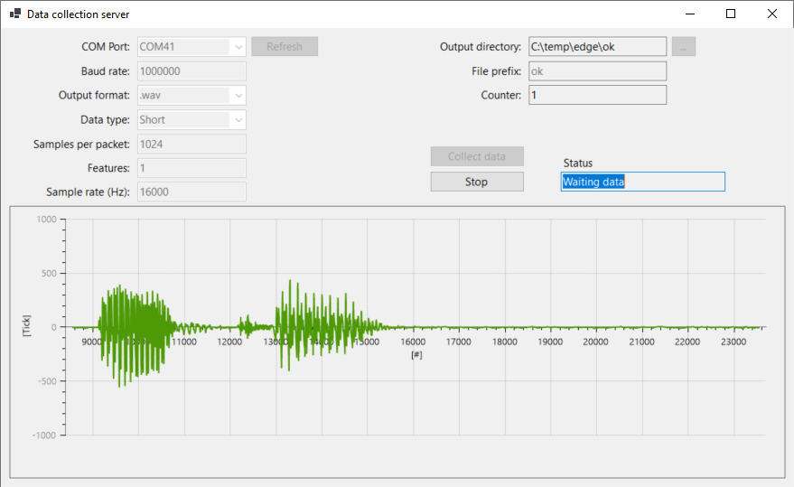
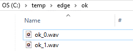

# Data collection server

**Important notes**
- The software is working with "fixed" configuration at the moment and has been developed to collect audio data and store them to a .wav file
- The parameters that are really used by the software at the moment: COM port, Baud Rate, Output directory, and file prefix
- The other parameters (output format, data type, samples per packet, feature and sample rate) will be used in a future version.



## Requirements
- The software has been tested using the CY8CKIT-06S2-43012 and CY8CKIT-028-SENSE development kits
- Following firmware has been used https://github.com/Infineon/mtb-example-ml-imagimob-data-collection

The source code of the software has been slightly changed to only use the USER_BTN1 to start and stop the data collection:

Main loop:
```
    for(;;)
    {
    	while(false == send_data);
        ...
    }
```

```
void gpio_interrupt_handler(void* handler_arg, cyhal_gpio_event_t event)
{
    (void) handler_arg;
    (void) event;

    /* Set flag */
    if (send_data == false)
    	send_data = true;
    else
    	send_data = false;
}
```

To gather audio data, you need to set the correct mode inside the config.h file:
```
#define COLLECTION_MODE_SELECT PDM_COLLECTION
```

## How to use the software

- Select the correct COM port and Baud Rate
- Select the output directory (the directory where the output file will be stored)
- Select a file prefix (each new generated file will start with this prefix)
- Press on "Collect data"
- Press on USER_BTN1 of the development kit to start to generate the data
- Once done, press again on USER_BTN1 to stop the data generation. A new file will be created inside the output directory.

Example: 


## Legal Disclaimer

The evaluation board including the software is for testing purposes only and, because it has limited functions and limited resilience, is not suitable for permanent use under real conditions. If the evaluation board is nevertheless used under real conditions, this is done at one’s responsibility; any liability of Rutronik is insofar excluded. 

